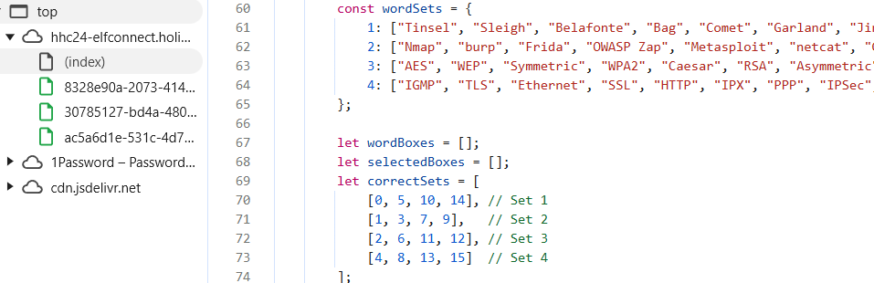
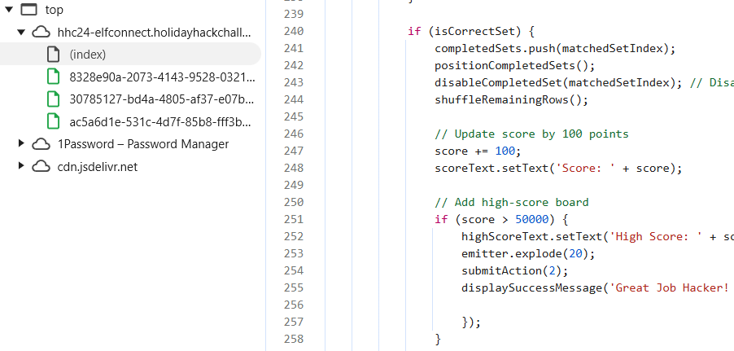
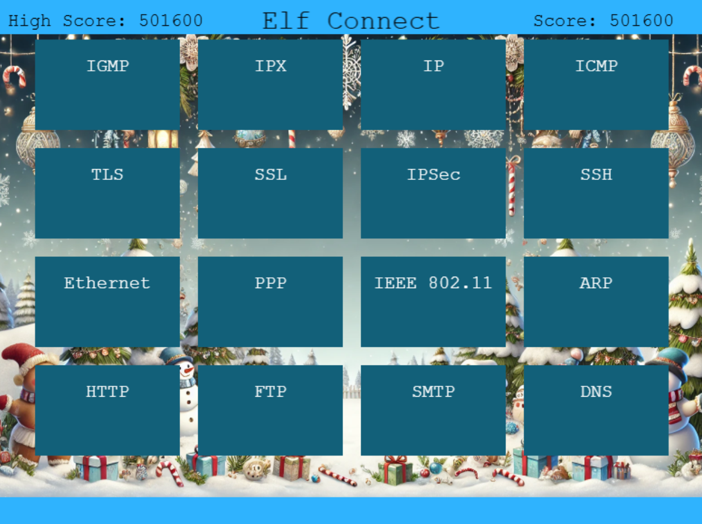

## Silver Objective
> I love brain games! This one is like the New York Times Connections game. Your goal here is to find groups of items that share something in common. Think of each group as having a hidden connection or theme—four items belong together, and there are multiple groups to find! See if you can spot patterns or common threads to make connections. Group all the items correctly to win!

I liked this puzzle because there's two ways to go about solving for this. The first one is by actually playing the game and identifying the four groups per round.

The second way to solve it is to view the web page via Developer Tools. When looking at the source code, I noticed the game was run completely on the client side and depended on a script to keep track of the keywords and solutions.



The word bank was stored in the variable `wordSets` while the `correctSets` variable housed the solution using the index number of each keyword. The solution never changed from one word bank so that made it easy to track what keywords were grouped together.

```javascript
const wordSets = {
    1: ["Tinsel", "Sleigh", "Belafonte", "Bag", "Comet", "Garland", "Jingle Bells", "Mittens", "Vixen", "Gifts", "Star", "Crosby", "White Christmas", "Prancer", "Lights", "Blitzen"],
    2: ["Nmap", "burp", "Frida", "OWASP Zap", "Metasploit", "netcat", "Cycript", "Nikto", "Cobalt Strike", "wfuzz", "Wireshark", "AppMon", "apktool", "HAVOC", "Nessus", "Empire"],
    3: ["AES", "WEP", "Symmetric", "WPA2", "Caesar", "RSA", "Asymmetric", "TKIP", "One-time Pad", "LEAP", "Blowfish", "hash", "hybrid", "Ottendorf", "3DES", "Scytale"],
    4: ["IGMP", "TLS", "Ethernet", "SSL", "HTTP", "IPX", "PPP", "IPSec", "FTP", "SSH", "IP", "IEEE 802.11", "ARP", "SMTP", "ICMP", "DNS"]
}

let correctSets = [
    [0, 5, 10, 14], // Set 1
    [1, 3, 7, 9],   // Set 2
    [2, 6, 11, 12], // Set 3
    [4, 8, 13, 15]  // Set 4
];
```

### Answers

Round 1
- Items on a Christmas Tree
- Things associated with Santa
- Christmas Singers and Songs
- Reindeer Names

Round 2
- Network scanning tools
- Web application testing
- Reverse engineering tools
- Command and control tools

Round 3
- Encryption types
- WiFi encryption
- Cryptography
- Ciphers

Round 4
- Network protocols for IP
- Protocols for secure internet connections
- Network connections between machines
- Protocols for data transfer


## Gold Objective
> WOW! A high score of 50,000 points! That’s way beyond the limit! With only four rounds and a max of 400 points per round, the top possible score should be 1,600 points. So, how did someone get to 50,000? Something unusual must be happening!

For this objective, it was helpful to know everything was handled on the client side. Searching for the keyword `score`, I found the piece of code that increments the value by 100 after every correct answer.



By opening the console and running the command `score = 50000`, I was able to override the initial value of 0 and start with the high score. Then, once I finished all the rounds using the cheatsheet from above, I was able to beat the high score and win the game!

