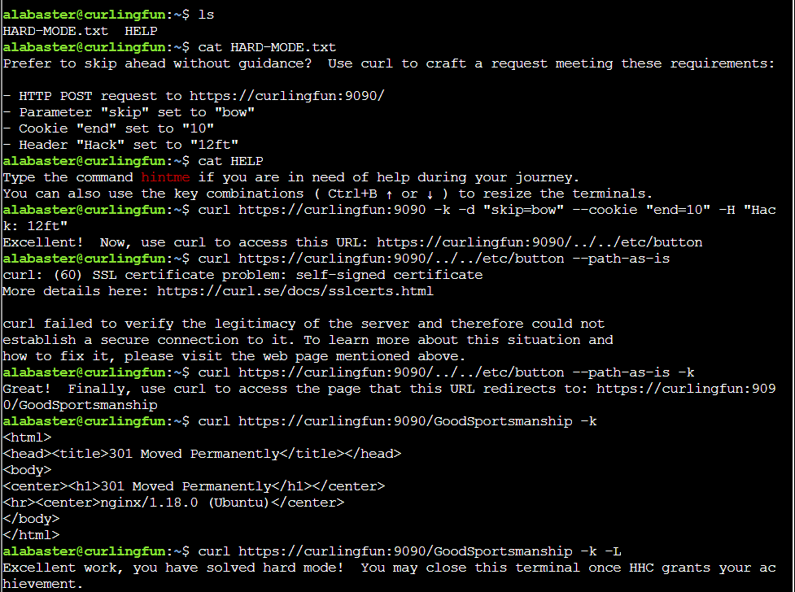

## Silver Objective

With this challenge, we're given a sort of walkthrough of different capabilities with the cURL utility. These exercises are very helpful for the Gold Objective since it uses a combination of these capabilities. 

Q1:
> Unlike the defined standards of a curling sheet, embedded devices often have web servers on non-standard ports.  Use curl to retrieve the web page on host "curlingfun" port 8080.
If you need help, run the 'hint' command.

A1:
```bash
curl curlingfun:8080
```

Q2:
> Embedded devices often use self-signed certificates, where your browser will not trust the certificate presented.  Use curl to retrieve the TLS-protected web page at https://curlingfun:9090/

A2:
```bash
curl https://curlingfun:9090 -k
```

Q3:
> Working with APIs and embedded devices often requires making HTTP POST requests. Use curl to send a request to https://curlingfun:9090/ with the parameter "skip" set to the value "alabaster", declaring Alabaster as the team captain.

A3:
```bash
curl https://curlingfun:9090 -k -d "skip=alabaster"
```

Q4:
> Working with APIs and embedded devices often requires maintaining session state by passing a cookie.  Use curl to send a request to https://curlingfun:9090/ with a cookie called "end" with the value "3", indicating we're on the third end of the curling match.

A4:
```bash
curl https://curlingfun:9090 -k --cookie "end=3"
```

Q5:
> Working with APIs and embedded devices sometimes requires working with raw HTTP headers.  Use curl to view the HTTP headers returned by a request to https://curlingfun:9090/

A5:
```bash
curl https://curlingfun:9090 -k --verbose
```

Q6:
> Working with APIs and embedded devices sometimes requires working with custom HTTP headers.  Use curl to send a request to https://curlingfun:9090/ with an HTTP header called "Stone" and the value "Granite".

A6:
```bash
curl https://curlingfun:9090 -k -H "Stone: Granite"
```

Q7:
> curl will modify your URL unless you tell it not to.  For example, use curl to retrieve the following URL containing special characters: https://curlingfun:9090/../../etc/hacks

A7:
```bash
curl https://curlingfun:9090/../../etc/hacks -k --path-as-is
```

## Gold Objective

Instead of jumping right into running curl commands, I checked to see if there were any hints on the host machine by running `ls` and noticed there was a `HARD-MODE.txt` file with a hint on how to solve this new puzzle. Using what I learned in the Silver Objective, it was fairly straightforward to apply that information

